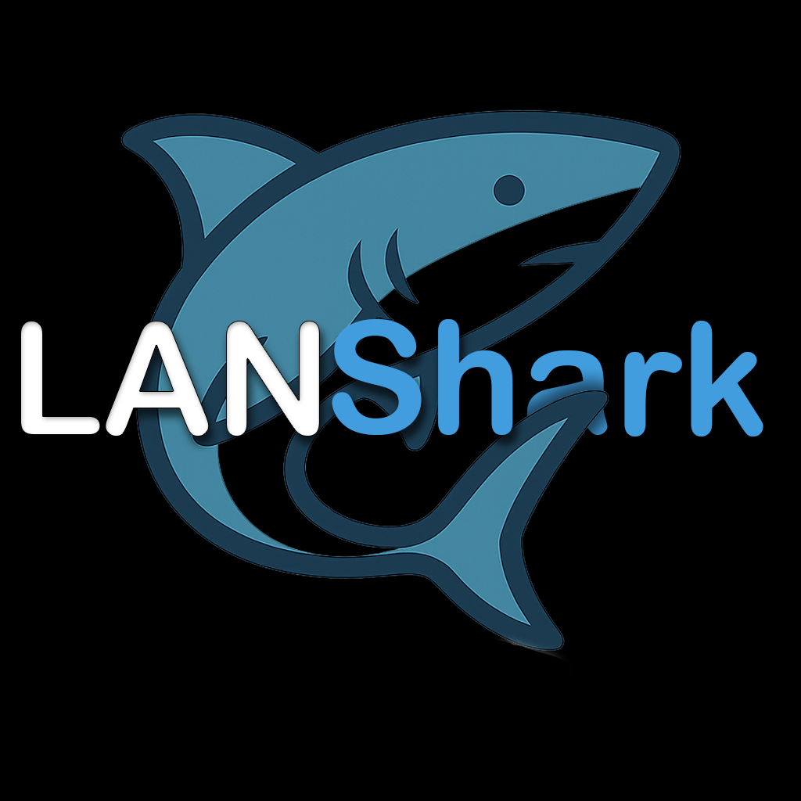

# LANShark



> **LANShark** is a powerful and intuitive iOS application designed to effortlessly track and display all devices connected to your local network. Built with Swift, LANShark empowers users with clear insights into their home or office network environment.

---

## 🚀 Features

- **Automatic Network Scanning:** Detects all devices on your local Wi-Fi network with a single tap.
- **Device Identification:** Displays device IP addresses, MAC addresses, and manufacturer details.
- **Real-Time Updates:** Reflects changes in your network as devices join or leave.
- **Intuitive UI:** Clean and modern interface for seamless user experience.
- **Privacy-Focused:** No data leaves your device—everything is processed locally.
- **iOS Native:** Built entirely with Swift for performance and reliability.

---

## 🛠️ Getting Started

### Prerequisites

- Xcode 15 or newer
- iOS 16.0+
- A Mac running macOS Ventura or later

### Installation

1. **Clone the repository:**
   ```sh
   git clone https://github.com/YourTypicalTeo/LANShark.git
   cd LANShark
   ```

2. **Open in Xcode:**
   - Double-click `LANShark.xcodeproj` or open via Xcode's `File > Open...`.

3. **Build and Run:**
   - Select your target device or simulator.
   - Press `⌘R` to build and run the app.

---

## ⚙️ Usage

1. Launch **LANShark** on your iOS device.
2. Grant the required network permissions when prompted.
3. Tap "Scan Network" to discover all devices currently connected to your Wi-Fi.
4. Browse through the list for detailed information about each device.

---

## 🧑‍💻 Contributing

Contributions are welcome! If you'd like to improve LANShark, please:

1. Fork the repository.
2. Create a new branch: `git checkout -b feature/YourFeature`.
3. Commit your changes: `git commit -am 'Add new feature'`.
4. Push to the branch: `git push origin feature/YourFeature`.
5. Open a Pull Request.

Please see [CONTRIBUTING.md](CONTRIBUTING.md) for full guidelines.

---

## 📝 License

This project is licensed under the [MIT License](LICENSE).

---

## 🙏 Acknowledgements

- [Apple Developer Documentation](https://developer.apple.com/documentation/)
- [Swift.org](https://www.swift.org/)
- Network scanning techniques inspired by open-source community projects

---

## 📫 Contact

For questions, suggestions, or support, please open an issue or contact [YourTypicalTeo](https://github.com/YourTypicalTeo).

---

<p align="center">
  <b>LANShark</b> &mdash; Keep your network in sight.
</p>
